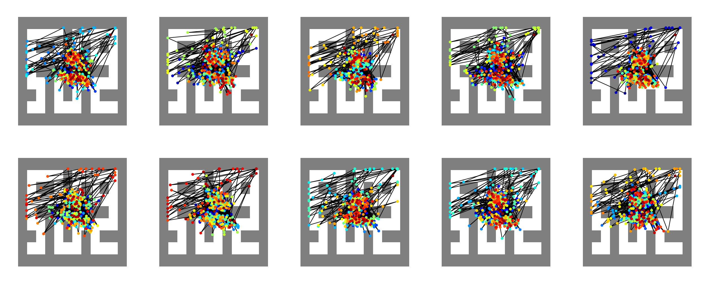
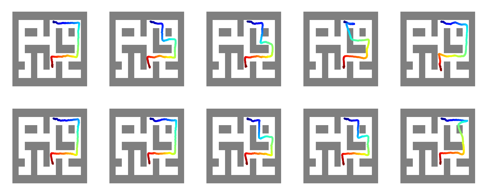

# Planning with Diffusion &nbsp;&nbsp; [](https://colab.research.google.com/drive/1YajKhu-CUIGBJeQPehjVPJcK_b38a8Nc?usp=sharing)


Training and visualizing of diffusion models from [Planning with Diffusion for Flexible Behavior Synthesis](https://diffusion-planning.github.io/).
This branch has the Maze2D experiments and will be merged into main shortly.

<p align="center">
    
</p>

## Original Diffuser Code
This code is based on the [original diffuser code](https://github.com/jannerm/diffuser/tree/maze2d) from UCB.

## MuJoCo Installation

To run this Diffuser, MuJoCo 2.00 should be installed. You can use the provided [`install_mujoco.sh`](install_mujoco.sh) script to automate the installation.

### Steps:

1. Copy the `install_mujoco.sh` file to your home directory.
2. Run the following commands to install MuJoCo 2.00:

   ```bash
   chmod +x install_mujoco.sh
   ./install_mujoco.sh
3. After installation, add the following lines to your `.bashrc` (or `.zshrc`):
    ```
    export MUJOCO_PY_MUJOCO_PATH=~/.mujoco/mujoco200
    export LD_LIBRARY_PATH=$LD_LIBRARY_PATH:~/.mujoco/mujoco200/bin
    ```
4. Apply the changes by running:
    ```
    source ~/.bashrc
    ```
## Installation

```
conda env create -f environment.yaml
conda activate diffuser
pip install -r requirements.txt 
pip install -e .
```

## Training

To train a diffusion model, use the following command:
```
python scripts/train.py --config config.maze2d --dataset maze2d-large-v1
```

The default hyperparameters can be found in [`config/maze2d.py`](config/maze2d.py). You can override any of these at runtime using flags. For example, to set a custom batch size, you can add `--batch_size 8` to your command.

For model-specific training details, check the [`diffuser/utils/training.py`](diffuser/utils/training.py) file. You can modify the training process, such as setting the frequency for labeling checkpoints, e.g., `--label_freq=100000`.

Training results will be stored in the following directory:
[`logs/maze2d-large-v1/diffusion/H384_T256`](logs/maze2d-large-v1/diffusion/H384_T256).

The trained model is saved as [`state_XXX.pt`](logs/maze2d-large-v1/diffusion/H384_T256/state_560000.pt). Alongside the model, training results are also saved as `.png` files. Below are two examples, showing results from epoch 0 and epoch 560000:

<p align="center">
    
</p>
<p align="center">
    
</p>

---

## Execution

To execute a plan using the trained diffusion model, run:


```
python scripts/plan_maze2d.py --config config.maze2d --dataset maze2d-large-v1
```

This will execute the most recently trained model in the maze2d environment. You can also modify [`scripts/plan_maze2d.py`] to specify which model to run by setting the desired epoch, e.g., `epoch=520000`.

Execution results are stored in the following directory:
[`logs/maze2d-large-v1/plans/release_H384_T256_LimitsNormalizer_b1_condFalse`](logs/maze2d-large-v1/plans/release_H384_T256_LimitsNormalizer_b1_condFalse). Below is an example result from epoch 520000:

<p align="center">
    
</p>


## Reference
```
@inproceedings{janner2022diffuser,
  title = {Planning with Diffusion for Flexible Behavior Synthesis},
  author = {Michael Janner and Yilun Du and Joshua B. Tenenbaum and Sergey Levine},
  booktitle = {International Conference on Machine Learning},
  year = {2022},
}
```


## Acknowledgements

The diffusion model implementation is based on Phil Wang's [denoising-diffusion-pytorch](https://github.com/lucidrains/denoising-diffusion-pytorch) repo.
The organization of this repo and remote launcher is based on the [trajectory-transformer](https://github.com/jannerm/trajectory-transformer) repo.
